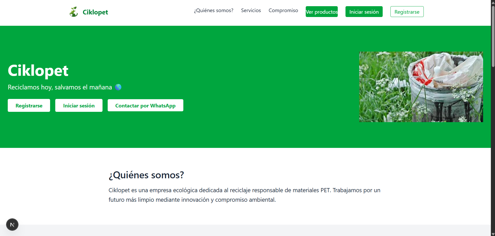
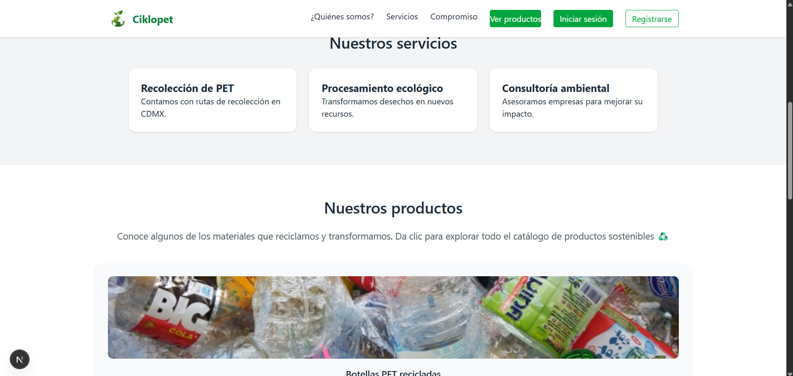
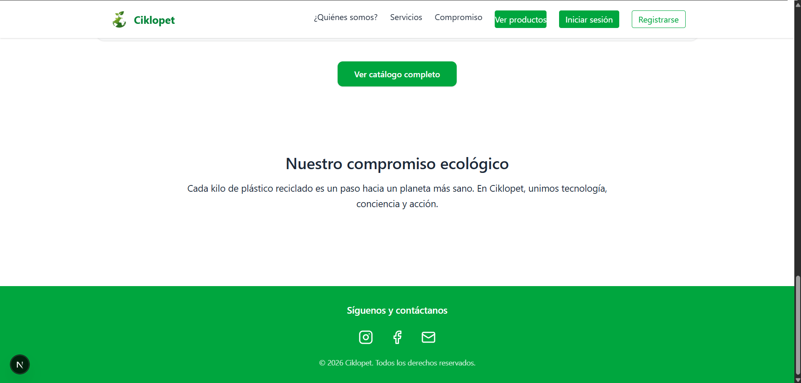
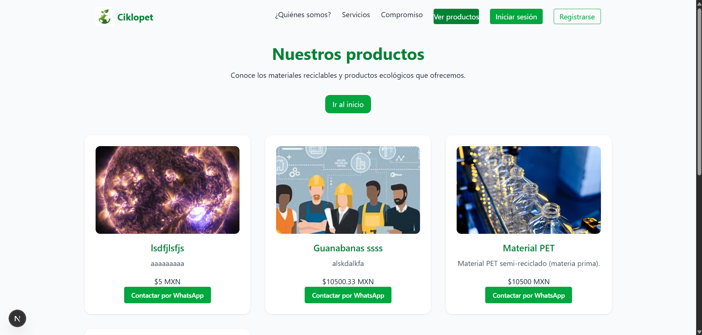
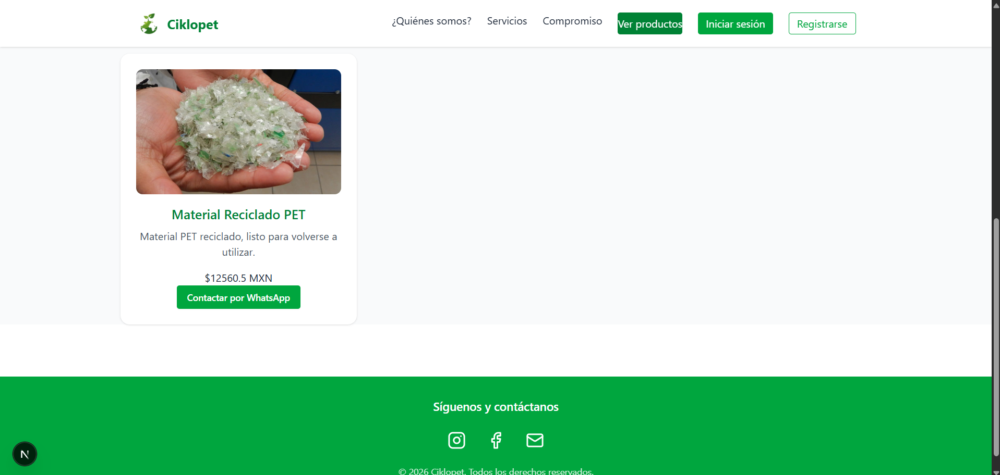
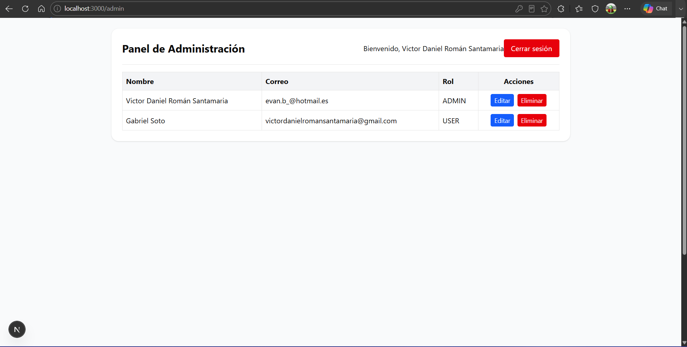
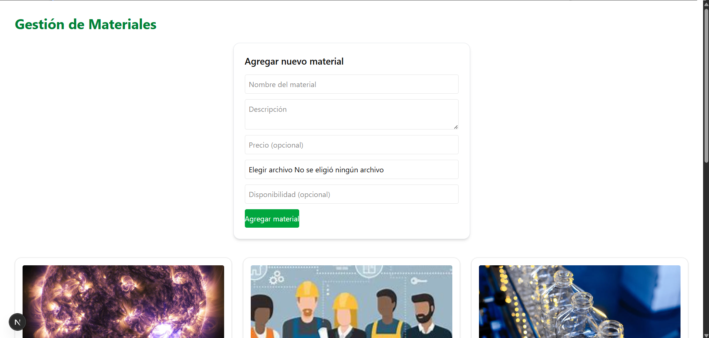
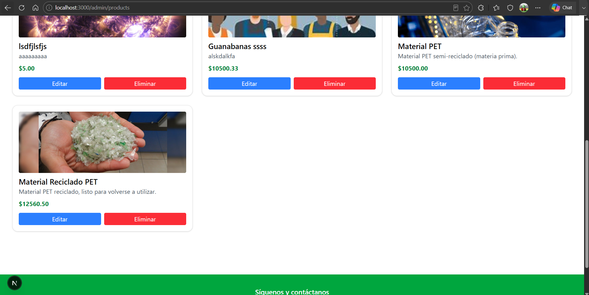
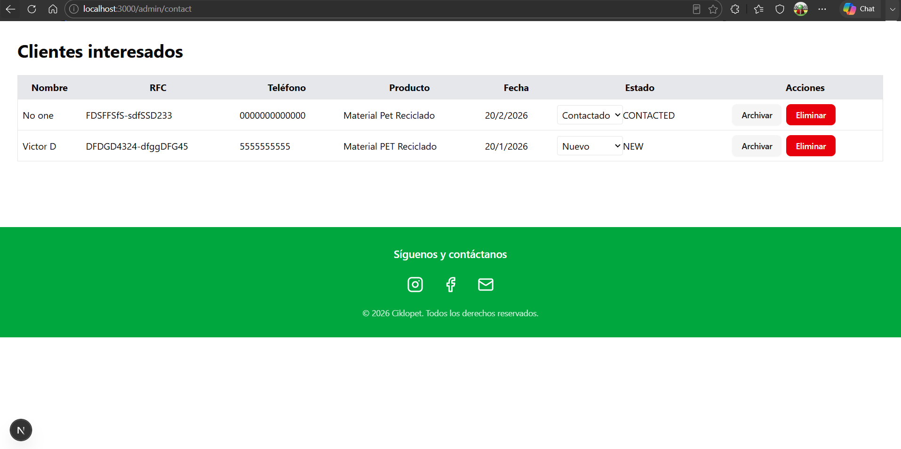
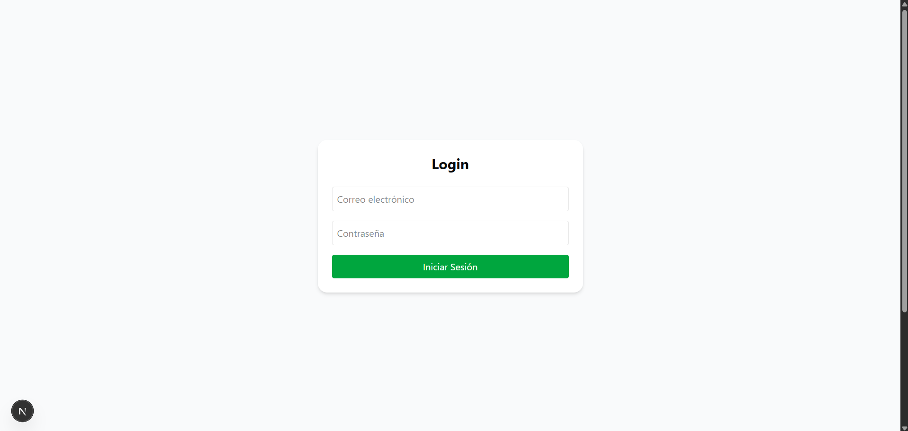

## Project Highlights

    - Built with Next.js and TypeScript.
    - PostgreSQL database integration.
    - Prisma ORM.
    - Authentication system.
    - Responsive UI with Tailwind CSS.
    - Production deployment on Vercel.


# Ciklopet Web

A modern web platform for a recycling business that helps users learn about recycling services, explore available products, and manage information through an administrative dashboard.


## Live Demo

https://ciklopet-web.vercel.app/


## Screenshots

### Home Page





### Products




### Admin Dashboard






### Login




## Tech Stack

### Frontend

    - Next.js
    - React
    - TypeScript
    - Tailwind CSS

### Backend

    - Node.js
    - Next.js API Routes

### Databases

    - PostgreSQL
    - Prisma ORM

### Authentication

    - NextAuth

### Deployment

    - Vercel


## Features

    - User authentication
    - Product catalog
    - Admin dashboard
    - Responsive design
    - PostgreSQL database integration
    - RESTful API endpoints


## Installation

Clone the repository:

```bash
git clone https://github.com/V1cT0RlNO/ciklopet-web.git
```

Go to the project directory:

```bash
cd ciklopet-web
```

Install dependencies:

```bash
npm install
```

Create environment variables:

```env
AUTH_SECRET=
DATABASE_URL=
NEXT_PUBLIC_BASE_URL=
NEXTAUTH_URL=
JWT_SECRET=

NEXT_PUBLIC_CLOUDINARY_CLOUD_NAME=
CLOUDINARY_API_KEY=
CLOUDINARY_API_SECRET=

NEXT_PUBLIC_WHATSAPP_NUMBER=
```

Run Prisma migrations:

```bash
npx prisma migrate dev
```

Generate Prisma client:

```bash
npx prisma generate
```

Start development server:

```bash
npm run dev
```

Open:

```text
http://localhost:3000
```


## Database Schema

The project uses PostgreSQL and Prisma ORM to manage:

    - Users
    - Products
    - Roles
    - Authentication


## Licence

MIT Licence
